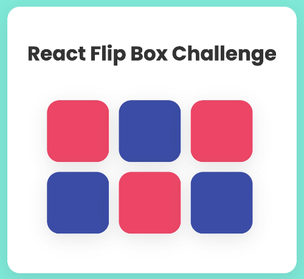
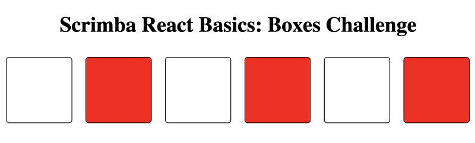
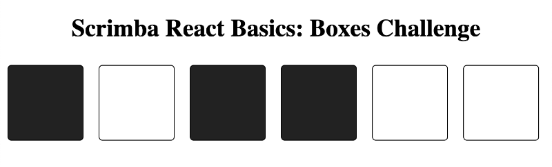

# React Basics: Boxes Challenge

## Project Overview

This project, based on Scrimba's React Basics tutorial, features a web application with six interactive boxes. Clicking on a box changes its color, demonstrating React's state management and how components interact. Check out the [Comprehensive Project Guide](#comprehensive-project-guide-react-basics-boxes-challenge) below for detailed steps, from the setup to more advanced concepts.

**See it in Action:** [React Basics Boxes Challenge on Netlify](https://react-basics-boxes-challenge.netlify.app/)

[](https://app.netlify.com/sites/react-basics-boxes-challenge/deploys)



Learn from the original tutorial:
- **Start your React journey here - the foundational tutorial:** [Scrimba React Basics](https://scrimba.com/playlist/pkGQkh3)
- **See the tutorial for the Boxes Challenge, which inspired this project:** [Part 1 on Scrimba](https://scrimba.com/learn/frontend/boxes-challenge-part-1-co4ff4b9f8504c9a03077bf2c)


---

# Comprehensive Project Guide: React Basics - Boxes Challenge

This guide takes you through the React Boxes Challenge step by step. Each section helps you understand a part of the project, from the very basics to more complex parts like state management and styling. Click the links to go to a detailed explanation for each step.

## Table of Contents

- [Project Overview](#project-overview)
- [Step 1: Initialize State with Boxes Data](#step-1-initialize-state-with-boxes-data)
- [Step 2: Dynamic Styling with Ternary Operator](#step-2-dynamic-styling-with-ternary-operator)
- [Step 3: Create Box Component](#step-3-create-box-component)
- [Step 4: Local State for Box Component](#step-4-local-state-for-box-component)
- [Step 5: Lifting State Up and Event Handling](#step-5-lifting-state-up-and-event-handling)
- [Step 6: Update Application State with Traditional Loop](#step-6-update-application-state-with-traditional-loop)
- [Step 7: Refactor State Update with Declarative Map Method](#step-7-refactor-state-update-with-declarative-map-method)
- [Styling Improvements](#styling-improvements)
- [React + Vite](#react--vite)

---

# Step Details

## Step 1: Initialize State with Boxes Data

Initialize React state with the default array of boxes, and map over this state to display each box.

### Understanding State Initialization in React

```jsx
const [squares, setSquares] = useState(boxes)
```

In React, `useState` is a Hook that lets you add state to functional components. Here's a breakdown of the line `const [squares, setSquares] = useState(boxes)`:

- `useState`: This is the Hook used to declare state in a functional component.
- `boxes`: This is the initial value given to our state variable. In this case, `boxes` is an array of objects, each representing a box with certain properties like `id` and `on`.
- `[squares, setSquares]`: This is array destructuring. `useState` returns a pair of values: the current state (`squares`) and a function that updates it (`setSquares`).

### State Variable: `squares`
The state variable `squares` is initialized with the data from `boxes`. This is how we store the boxes' data in the component's state, allowing us to re-render the component with updated data when changes are made.

### State Setter Function: `setSquares`
`setSquares` is the function we call when we want to update our state. It takes the new state value as an argument and schedules an update to the component's state.

### Initial State: `boxes`
The `boxes` parameter is the initial state for our `squares` state variable. By passing `boxes` to `useState`, we're telling React, "Here's the initial data I want to track in state for this component."

Using `useState` with the initial `boxes` array allows the component to have its own mutable state that can be updated independently, which is crucial for building interactive UIs in React.


### Code Examples for Step 1

Here are two ways to map over the `squares` state and display each box, showcasing the difference between arrow functions and traditional function syntax:

Using an arrow function:

```jsx
const squareElements = squares.map(square => <div key={square.id} className="box"></div>)
```

Using the traditional function syntax:

```jsx
const squareElements = squares.map(function(square) {
  return <div key={square.id} className='box'></div>
})
```


## Step 2: Dynamic Styling with Ternary Operator

In this step, we apply a dynamic styling based on the `on` state of each box. This is done by using a ternary operator within the map function.



The code for dynamically styling the boxes is as follows:

### Code Example for Step 2

Here's how you dynamically apply styles to the boxes using a ternary operator within the map function:

```jsx
const squareElements = squares.map(square => {
    const styles = {
        backgroundColor: square.id % 2 === 0 ? 'red' : 'white',
    }

    return <div key={square.id} className="box" style={styles}></div>
})
```

## Step 3: Create Box Component

For this step, we refactored our application to include a `Box` component. Each box's appearance is determined by its `on` property, which is passed down as a prop from the `App` component.

The `Box` component uses the `on` prop to set the `backgroundColor` dynamically.



```jsx
// App component
const squareElements = squares.map(square => <Box key={square.id} on={square.on} />)
```

```jsx
// Box component
function Box(props) {
    const styles = {
        backgroundColor: props.on ? '#222222' : 'transparent',
    }
    return (
        <div className="box" style={styles}></div>
    )
}
```


## Step 4: Local State for Box Component

In this step, we added local state management to the `Box` component. We utilized the `useState` hook to handle the `on` state, which determines whether the box is in its "on" or "off" state.

Here's how we implemented the toggle functionality:

```jsx
// Box component with local state and toggle function
function Box(props) {
    const [on, setOn] = React.useState(props.on)

    const styles = {
        backgroundColor: on ? '#222222' : 'transparent',
    }

    function toggle() {
        setOn(prevOn => !prevOn)
    }

    return (
        <div className="box" style={styles} onClick={toggle}></div>
    )
}
```


## Step 5: Lifting State Up and Event Handling

In React, data is passed down from parent to child components via props, and events are communicated up from children to parents through functions passed as props.

### Understanding Data Flow in React

React's unidirectional data flow means that:

- **Props Down**: Data is passed down from parent to child components through props. Children can use these props but cannot change them.
- **Events Up**: When an event occurs in a child component, such as a user clicking a box, the child notifies the parent by calling a function passed down via props.
- **State Updates in Parent**: The parent component, which owns the state, updates the state. The new state is passed down to the children, causing the UI to re-render with the updated state.

### Implementing Click Events with Arrow Functions

For a child component to communicate an event to a parent, we use arrow functions to pass additional parameters, such as an item's id. Here's how we handle a click event in a child component and pass the event up to the parent component to update the state:

```jsx
// In the child component (Box.js)
<div className="box" style={styles} onClick={() => props.toggle(props.id)}></div>
```

The arrow function `() => props.toggle(props.id)` ensures that the toggle function is not called immediately but instead when the click event occurs. This allows us to pass the id of the clicked box up to the toggle function in the parent component.

### Code Example for Step 5

Here's how we lifted the state up to the App component and passed down the toggle function to the Box component:

```jsx
// In the parent component (App.js)
const [squares, setSquares] = useState(boxes);

function toggle(id) {
    // Logic to update the state based on the clicked box's id
}

const squareElements = squares.map(square => (
    <Box key={square.id} id={square.id} on={square.on} toggle={toggle} />
));

return (
    <main>
        <h1>Scrimba React Basics: Boxes Challenge</h1>
        {squareElements}
    </main>
);
```

In the App component, the toggle function is defined and then passed to each Box component. When a box is clicked, the toggle function is invoked with the correct id, allowing the App component to update its state accordingly.


## Step 6: Update Application State with Traditional Loop

In this step, we enhance the toggle functionality in our application to change the state of the boxes using a traditional loop method. The goal is to update the `on` state of the box that is clicked.

Here's how we've implemented the toggle function:

```jsx
function toggle(id) {
    setSquares(prevSquares => {
        const updatedSquaresArray = []
        for (let i = 0; i < prevSquares.length; i++) {
            const currentSquare = prevSquares[i]
            if (currentSquare.id === id) {
                updatedSquaresArray.push({
                    ...currentSquare,
                    on: !currentSquare.on, // Toggle the on state
                })
            } else {
                updatedSquaresArray.push(currentSquare)
            }
        }
        return updatedSquaresArray // Don't forget to return the new state array
    })
}
```

## Step 7: Refactor State Update with Declarative Map Method

Refactoring the toggle function to use the `.map()` method enhances the readability and declarativeness of our code. Here's how the updated toggle function looks:

```jsx
function toggle(id) {
    setSquares(prevSquares => prevSquares.map(square => 
        square.id === id ? { ...square, on: !square.on } : square
    ));
}
```

This concise implementation iterates over the array of squares, and for each square, it checks if the id matches. If it does, a new object is created with the on property toggled. Otherwise, the square is returned as is. This not only makes the code easier to understand but also aligns with functional programming best practices.


## Styling Improvements

After ensuring functionality, focus on enhancing the UI with improved styling and animations.


# React + Vite

This template provides a minimal setup to get React working in Vite with HMR and some ESLint rules.

Currently, two official plugins are available:

- [@vitejs/plugin-react](https://github.com/vitejs/vite-plugin-react/blob/main/packages/plugin-react/README.md) uses [Babel](https://babeljs.io/) for Fast Refresh
- [@vitejs/plugin-react-swc](https://github.com/vitejs/vite-plugin-react-swc) uses [SWC](https://swc.rs/) for Fast Refresh
